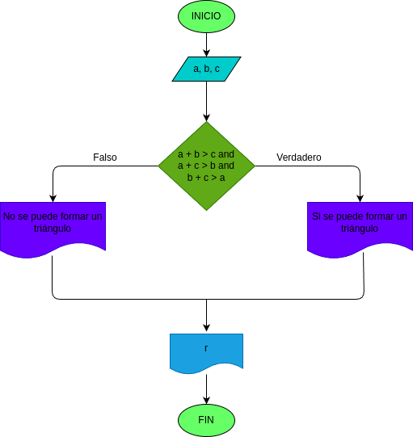

# Quiz instrucciones condicionales

### Realice el análisis, diseño y construcción para resolver el siguiente problema:

Dados tres números a, b y c, correspondientes a la longitud de los lados de una figura geométrica, determinar si pueden formar los lados de un triángulo.

## input

### Variables de entrada
a: longitud del primer lado del triángulo

b: longitud del segundo lado del triángulo

c: longitud del tercer lado del triángulo

### processing
resultado: determinar si los valores ingresados pueden formar un triángulo

Reglas de validación:
Si se cumplen las siguientes condiciones simultáneamente:
- a + b > c
- a + c > b
- b + c > a

Entonces, los valores ingresados pueden formar un triángulo.
De lo contrario, no se puede formar un triángulo.

### output
resultado: Mensaje indicando si los valores forman un triángulo o no.

### Diagrama de flujo
